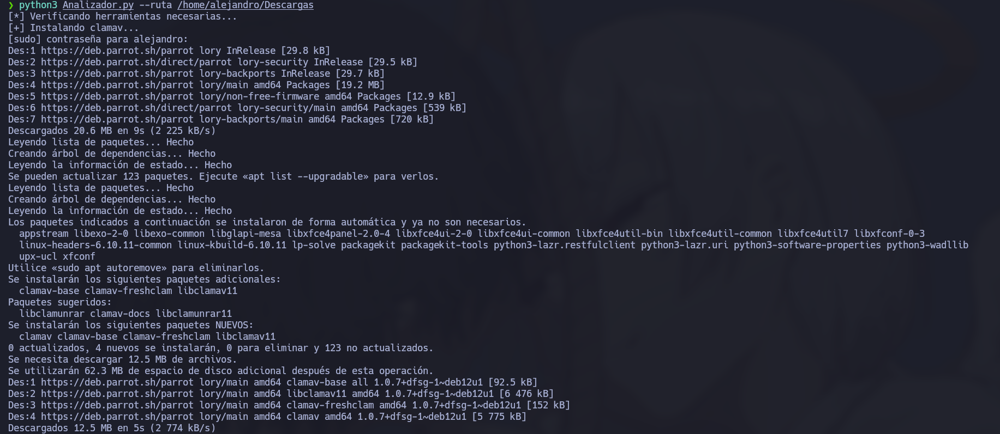
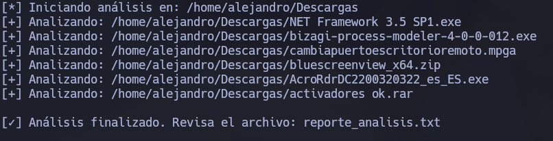

# 🕵️‍♂️ Analizador Forense de Archivos

Este script realiza un análisis forense automatizado sobre archivos en un directorio, identificando posibles amenazas, metadatos sospechosos, y cadenas codificadas o maliciosas.

## 🔍 Funcionalidades

- Escaneo antivirus con ClamAV
- Extracción y análisis de metadatos con ExifTool
- Detección de herramientas de edición sospechosas
- Análisis de patrones maliciosos: IPs, URLs, correos, contraseñas, tokens/API keys
- Decodificación de cadenas en Base64
- Análisis binario con Binwalk
- Extracción de cadenas con `strings`

---

## 📥 Descarga e instalación

1. Clona el repositorio:

```bash
git clone https://github.com/Alejandro609x/analizador-forense.git
cd analizador-forense
````

2. Ejecuta el script (con `sudo` para que pueda instalar herramientas si faltan):

```bash
sudo python3 Analizador.py --ruta /ruta/a/analizar
```

> Si no se proporciona una ruta, se analizará el directorio actual por defecto.

---

## 🧠 ¿Cómo funciona este script?

El archivo `Analizador.py` automatiza el análisis forense de todos los archivos dentro de un directorio mediante las siguientes etapas:

1. **Verificación e instalación de herramientas necesarias**

   * `clamav`: escaneo antivirus
   * `exiftool`: lectura de metadatos
   * `file`: identificación del tipo de archivo
   * `binwalk`: análisis de contenido binario
   * `strings`: extracción de cadenas legibles

2. **Análisis de cada archivo**:

   * Identificación de tipo de archivo
   * Fechas de creación y modificación
   * Escaneo antivirus
   * Extracción de metadatos y búsqueda de anomalías
   * Detección de herramientas sospechosas usadas para modificar el archivo
   * Análisis binario para detectar datos embebidos
   * Búsqueda de IPs, URLs, correos, contraseñas, tokens y cadenas en Base64

3. **Generación de reporte**:

   * Se crea un archivo `reporte_analisis.txt` con la información completa por cada archivo analizado.

---

## 🖼 Ejemplo visual

### 🔧 Instalación automática de herramientas (al ejecutar por primera vez):



### ✅ Resultado tras ejecutar el análisis:



---

## 📂 Ejemplo de uso

```bash
sudo python3 Analizador.py --ruta ./documentos
```

Esto generará un archivo `reporte_analisis.txt` que incluye:

* Tipo del archivo
* Fechas de creación y modificación
* Estado del antivirus
* Herramientas sospechosas detectadas
* Cadenas sospechosas encontradas
* Metadatos completos y posibles anomalías
* Contenido oculto detectado con Binwalk

---

## 📄 Licencia

Distribuido bajo la licencia MIT. Ver el archivo [`LICENSE`](LICENSE) para más detalles.

---

## 🤝 Autor

Desarrollado por [Alejandro609x](https://github.com/Alejandro609x)
